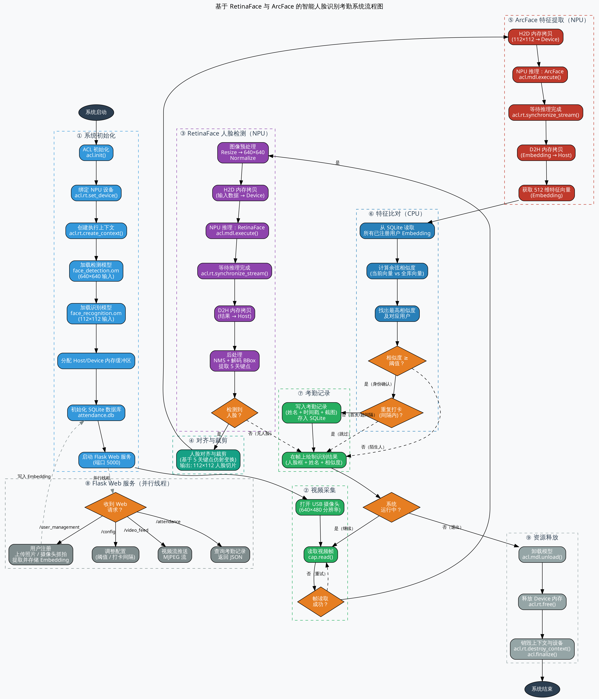

<!-- _class: cover -->

# 案例 1：边缘人脸考勤

- 案例：边缘人脸考勤——FastAPI 与昇腾 NPU 协同，对应 `samples/case1`
- 专题安排：3 课时，每课时 45 分钟
- 主线：系统架构与模型合同 → FastAPI/NPU 与本地检查 → 板端运行与 API 验收
- 隐私要求：本讲只使用合成或经同意的匿名测试图像，不展示真实人脸图片

---

# 本讲路线

| 课时 | 时长 | 主题 |
| --- | --- | --- |
| 第1课时 | 45 分钟 | 系统架构与模型合同 |
| 第2课时 | 45 分钟 | FastAPI/NPU 与本地检查 |
| 第3课时 | 45 分钟 | 板端运行与 API 验收 |

- 样例源码：`samples/case1/app.py`、`face_attendance/inference.py`、`face_attendance/runtime.py`
- 配套文档：`docs/01-model-contract.md`、`docs/02-fastapi-react-architecture.md`、`docs/03-board-acceptance.md`
- 贯穿目标：不把“网页能打开”当作“NPU 已就绪”，不把一次 HTTP 成功当作识别精度结论

---

# 第1课时：系统架构与模型合同

课时目标：

1. 说清采集层、硬件工作层、服务层、界面层之间的边界；
2. 按输入、输出、前处理合同检查 ONNX/OM，而不是只看文件名；
3. 解释 PyACL 初始化、Host/Device 拷贝、模型执行和资源释放的顺序；
4. 区分静态检查、转换检查、ACL 烟测、API 烟测和性能实验。

---

## 案例定位与系统边界

| 边界 | 本案例承担的工作 | 不在本案例结论范围内 |
| --- | --- | --- |
| 图像采集 | 板端 USB 摄像头采集；浏览器可提交单张图像 | 摄像头质量、光照和姿态的全面评测 |
| 模型推理 | 在昇腾 NPU 上执行已转换的检测和特征模型 | 重新训练模型或证明公开基准精度 |
| 身份比对 | 主机内存中计算余弦相似度并选取最高候选 | 法律意义上的身份认证或活体认证 |
| 数据保存 | SQLite 保存用户、特征和事件元数据 | 云端同步、多人权限和长期档案管理 |
| Web 交互 | FastAPI API 与 React 界面 | 互联网暴露、生产级认证和高可用集群 |

说明：自动登记陌生人是本案例保留的教学演示策略，不代表经过同意的身份注册，也不构成生产级认证方案。

---

<!-- _class: visual -->

## 案例1仓库流程图：采集到打卡



<div class="source">图源：<a href="https://github.com/zhouxzh/Ascend310/blob/main/src/experiment/img1/case1_flow.png">src/experiment/img1/case1_flow.png</a>；正文：<a href="https://github.com/zhouxzh/Ascend310/blob/main/src/experiment/case1.md">src/experiment/case1.md</a>；实现：<a href="https://github.com/zhouxzh/Ascend310/tree/main/samples/case1">samples/case1/</a></div>

---

## 系统四层架构

1. 采集层：板端 `VideoCamera` 读取摄像头帧并维护最近一帧；React 可用浏览器摄像头或上传图像生成输入。
2. 硬件工作层：一个受控运行线程顺序调用检测、裁剪和特征提取，避免多个 HTTP 请求同时使用同一个 ACL context、Device buffer 或摄像头句柄。
3. 服务层：FastAPI 将注册、抓拍、手动打卡、记录查询和 MJPEG 预览暴露为 HTTP 资源。
4. 界面层：React 调用 API 并呈现状态；“自动登记”标签必须说明其教学属性。

---

## 一次图像请求的逻辑顺序

1. FastAPI 读取 multipart 文件或 base64 图像，并限制请求大小；
2. OpenCV 解码图像，检查图像非空且位于允许的处理范围；
3. 检测模型定位候选人脸，选择面积最大的候选作为本案例的简化策略；
4. 根据边界框裁剪人脸并送入特征模型；
5. 将输出向量与数据库中的向量逐一计算余弦相似度；
6. 注册请求写入用户和头像，打卡请求在通过阈值时写入事件；
7. API 返回结构化结果，界面根据 `success`、`match` 或错误状态更新视图。

说明：这是便于教学的串行流程，不声称对多人脸、遮挡、姿态或大规模用户库具有最佳性能。

---

## 组件关系图

```text
React/Vite 浏览器
    │ HTTP、multipart、MJPEG
    ▼
FastAPI 应用工厂
    │ lifespan 初始化与关闭
    ▼
单一硬件工作队列       进程内 SQLite 锁
    │
    ├── OpenCV 摄像头与 JPEG 缓存
    └── PyACL context/stream
          ├── face_detection.om
          └── face_recognition.om
```

解释：FastAPI 层不重复实现推理算法；摄像头和 NPU 都归单一硬件工作队列管理，MJPEG 客户端只读取缓存 JPEG，连接数增加不会自动增加 NPU 推理次数。

---

<!-- _class: compact -->

## 案例1源码地图：入口到 NPU

```text
samples/case1/
├── app.py                         FastAPI launcher
├── face_attendance/api.py         routes + lifecycle
├── face_attendance/inference.py   preprocess + detect/embed
├── face_attendance/runtime.py     PyACL model execution
└── frontend/src/App.tsx           React workflow UI
```

<div class="source">源码：<a href="https://github.com/zhouxzh/Ascend310/tree/main/samples/case1">samples/case1/</a>；合同：<a href="https://github.com/zhouxzh/Ascend310/blob/main/samples/case1/docs/01-model-contract.md">docs/01-model-contract.md</a></div>

---

## 模型文件角色

| 逻辑角色 | ONNX 文件（准备阶段） | OM 文件（运行阶段） | 当前实现合同 |
| --- | --- | --- | --- |
| 人脸检测 | `models/det_500m.onnx` | `models/face_detection.om` | `1×3×640×640` 浮点输入 |
| 特征提取 | `models/w600k_mbf.onnx` | `models/face_recognition.om` | `1×3×112×112` 浮点输入，输出特征向量 |

说明：文件名是工程约定，不足以证明网络的论文名称或训练来源。输出数量、形状、数据类型和后处理假设必须用 `scripts/check_onnx.py`、`scripts/check_onnx_out.py` 及板端运行检查确认。

---

## 输入和前处理代码

```python
    def preprocess_det(self, image):
        target_size = (640, 640)
        img = cv2.resize(image, target_size)
        img = img.astype(np.float32)
        # Assuming model expects BGR, mean subtraction
        # Buffalo_s det usually: - mean(104, 117, 123)? Or no mean?
        # InsightFace scrfd usually doesn't need mean subtraction if model is simple, but often it does.
        # Let's try standard mean subtraction.
        # However, many ONNX models from InsightFace expect RGB?
        # Checking input.1 usually implies standard normalization.
        # I'll stick to simple subtraction for now.
        img -= np.array([127.5, 127.5, 127.5], dtype=np.float32)
        img /= 128.0

        img = img.transpose(2, 0, 1)
        img = np.expand_dims(img, axis=0)
        return img, image.shape[:2] # Return original shape for scaling back

    def preprocess_rec(self, face_img):
        img = cv2.resize(face_img, (112, 112))
        img = img.astype(np.float32)
        img = (img - 127.5) / 128.0
        img = img.transpose(2, 0, 1)
        img = np.expand_dims(img, axis=0)
        return img
```

解释：摄像头帧通常以 BGR 排列进入 OpenCV，代码先缩放、归一化，再转成 `NCHW`。检测和特征模型各有一组固定输入形状；这些尺寸和归一化常数属于运行时合同，改变任何一项都要重新做输入输出检查和数值烟测。

---

<!-- _class: tight -->

## 检测输出合同

当前后处理实现按三种 stride（8、16、32）组织分数和边界框距离，并预留关键点输出。代码期望检测模型提供九个可解释的输出张量：三组分数、三组边界框偏移和三组关键点。

```python
    def decode_bbox(self, anchors, raw_outputs):
        # This is tricky without knowing exact output order.
        # Based on ONNX check:
        # 0,1,2: Scores (8, 16, 32)
        # 3,4,5: BBox (8, 16, 32)
        # 6,7,8: Landmarks

        if len(raw_outputs) < 6:
            raise ModelNotReadyError("人脸检测模型输出数量不满足后处理合同")

        # Flatten and concat
        # Order: 8, 16, 32

        # Scores
        s8 = np.frombuffer(raw_outputs[0], dtype=np.float32).reshape(-1, 1)
        s16 = np.frombuffer(raw_outputs[1], dtype=np.float32).reshape(-1, 1)
        s32 = np.frombuffer(raw_outputs[2], dtype=np.float32).reshape(-1, 1)
        score_all = np.concatenate([s8, s16, s32], axis=0)

        # BBoxes
        b8 = np.frombuffer(raw_outputs[3], dtype=np.float32).reshape(-1, 4)
        b16 = np.frombuffer(raw_outputs[4], dtype=np.float32).reshape(-1, 4)
        b32 = np.frombuffer(raw_outputs[5], dtype=np.float32).reshape(-1, 4)
        bbox_all = np.concatenate([b8, b16, b32], axis=0)
        if score_all.shape[0] != anchors.shape[0] or bbox_all.shape[0] != anchors.shape[0]:
            raise ModelNotReadyError("人脸检测模型输出形状不满足后处理合同")
```

解释：分数阈值筛选、坐标缩放、NMS 和裁剪都在主机侧完成；“能够加载 OM”不能证明输出顺序正确，必须先确认输出合同。

---

## 特征输出合同

当前代码从第一个输出缓冲区读取 `float32` 数组，预期向量长度为 512，存入 SQLite 前检查数组连续性和维度。

```python
    def get_embedding(self, face_img):
        if not self.rec_model:
            raise ModelNotReadyError("人脸识别模型未就绪")

        input_tensor = self.preprocess_rec(face_img)
        outputs = self.rec_model.execute([input_tensor])
        if not outputs or outputs[0].nbytes % np.dtype(np.float32).itemsize:
            raise ModelNotReadyError("人脸特征模型输出不满足 float32 合同")
        embedding = np.frombuffer(outputs[0], dtype=np.float32)
        if embedding.size != 512:
            raise ModelNotReadyError(
                f"人脸特征模型输出维度不匹配: expected=512 actual={embedding.size}"
            )
        return embedding
```

解释：512 是当前样例预期值，最终维度应以 ONNX/OM 描述和板端输出字节数为准。读取 SQLite BLOB 时必须使用同样的 `float32` 类型和字节序，更换模型后不得直接混用旧特征。

---

<!-- _class: compact -->

## PyACL 初始化和释放（板端步骤）

以下代码只应在已加载匹配 CANN 环境的昇腾板端执行，开发机不运行 `acl`、NPU、ATC 或 OM 推理。

```python
def check_ret(ret, message):
    if isinstance(ret, tuple):
        ret = ret[-1]
    if ret != 0:
        raise Exception(f"{message} failed ret={ret}")

class AscendSystem:
    def __init__(self, device_id=0):
        self.device_id = device_id
        self.context = None
        self.stream = None
        self._init_resource()

    def _init_resource(self):
        ret = acl.init()
        check_ret(ret, "acl.init")

        ret = acl.rt.set_device(self.device_id)
        check_ret(ret, "acl.rt.set_device")

        self.context, ret = acl.rt.create_context(self.device_id)
        check_ret(ret, "acl.rt.create_context")

        self.stream, ret = acl.rt.create_stream()
        check_ret(ret, "acl.rt.create_stream")
        print(f"[AscendSystem] Device {self.device_id} initialized.")

    def release(self):
        if self.stream:
            acl.rt.destroy_stream(self.stream)
        if self.context:
            acl.rt.destroy_context(self.context)
        acl.rt.reset_device(self.device_id)
        acl.finalize()
        print("[AscendSystem] Resources released.")
```

<p class="compact-note">解释：生命周期顺序是 <code>acl.init</code> → 设置设备 → 创建 context/stream → 释放时按逆序销毁。不能依赖 Python 析构函数的执行顺序。</p>

---

## AscendModel 执行：Host → Device 拷贝（板端步骤）

```python
    def execute(self, input_data_list):
        acl.rt.set_context(self.context)
        if len(input_data_list) != len(self.input_buffers):
            raise ModelNotReadyError(
                f"模型输入数量不匹配: expected={len(self.input_buffers)} actual={len(input_data_list)}"
            )
        for i, data in enumerate(input_data_list):
            data = np.ascontiguousarray(data)
            if data.dtype != np.float32:
                raise ModelNotReadyError(f"模型输入类型不匹配: input[{i}] 必须为 float32")
            expected_size = self.input_buffers[i]["size"]
            if data.nbytes != expected_size:
                raise ModelNotReadyError(
                    f"模型输入字节数不匹配: input[{i}] expected={expected_size} actual={data.nbytes}"
                )
            ptr = acl.util.bytes_to_ptr(data.tobytes())
            size = data.nbytes
            ret = acl.rt.memcpy(self.input_buffers[i]["ptr"], self.input_buffers[i]["size"],
                                ptr, size, 1)
            check_ret(ret, "acl.rt.memcpy host->device")
```

解释：每个模型都通过单一 `AscendModel` 管理输入 dataset 和 Device buffer；执行前必须校验输入数量、`float32` 类型和字节数，避免把错误张量静默送进 NPU。

---

## AscendModel 执行：模型执行与 Device → Host（板端步骤）

```python
        ret = acl.mdl.execute(self.model_id, self.input_dataset, self.output_dataset)
        check_ret(ret, "acl.mdl.execute")

        outputs = []
        for i in range(len(self.output_buffers)):
            size = self.output_buffers[i]["size"]
            if size % np.dtype(np.float32).itemsize:
                raise ModelNotReadyError(f"模型输出字节数不是 float32 的整数倍: output[{i}]")
            host_data = np.zeros(size, dtype=np.byte)
            host_ptr = host_data.ctypes.data
            ret = acl.rt.memcpy(host_ptr, size,
                                self.output_buffers[i]["ptr"], size, 2)
            check_ret(ret, "acl.rt.memcpy device->host")
            outputs.append(host_data)
        return outputs
```

解释：`acl.mdl.execute` 使用预先创建的数据集执行模型，再把 Device 输出拷贝回主机；返回的是字节数组，后续由检测解码或特征读取代码按 `float32` 合同解释。

---

## 单一硬件所有者：NpuWorker

```python
class NpuWorker:
    """Own one FaceSystem instance and serialize all calls to it."""

    def __init__(self, backend_factory: Optional[Callable[[], Any]] = None):
        self._backend_factory = backend_factory or self._default_backend_factory
        self._queue = queue.Queue()
        self._thread = None
        self._ready_event = threading.Event()
        self._stop_event = threading.Event()
        # A readiness failure is reported while holding this lock and the
        # error property takes the same lock; use an RLock to avoid a
        # self-deadlock on the fail-closed path.
        self._state_lock = threading.RLock()
        self._backend = None
        self._error = None
        self._ready = False

    @staticmethod
    def _default_backend_factory():
        # Deliberately lazy: importing the web API must not import acl.
        from .inference import FaceSystem

        return FaceSystem()
```

解释：`FaceSystem` 实例由 `NpuWorker` 独占，所有调用通过队列提交。启动失败用 `ready=False` 表示，API 仍可返回静态页面和健康诊断，但依赖模型的接口返回 `503`。

---

## InferenceProxy 与最大人脸策略

```python
class InferenceProxy:
    """FaceSystem-shaped proxy used by the camera thread."""

    def __init__(self, worker: NpuWorker):
        self._worker = worker

    def detect(self, image, threshold=0.5):
        return self._worker.call("detect", image, threshold=threshold)

    def get_embedding(self, face_image):
        return self._worker.call("get_embedding", face_image)


def _largest_face(faces, image):
    if not faces:
        return image
    best = max(faces, key=lambda box: (box[2] - box[0]) * (box[3] - box[1]))
    x1, y1, x2, y2 = map(int, best)
    height, width = image.shape[:2]
    x1, y1 = max(0, x1), max(0, y1)
    x2, y2 = min(width, x2), min(height, y2)
    if x2 <= x1 or y2 <= y1:
        return image
    return image[y1:y2, x1:x2]
```

解释：摄像头线程通过 `InferenceProxy` 向硬件工作线程提交任务，不直接操作 PyACL。检测出多张人脸时选择面积最大者，是单人考勤演示的确定性简化策略。

---

# 第2课时：FastAPI/NPU 与本地检查

课时目标：

1. 读懂 FastAPI 入口、API 资源和健康状态语义；
2. 解释注册与手动打卡如何进入单一硬件工作队列；
3. 明确本地纯 Python 检查、静态 ONNX 检查和板端硬件检查的边界；
4. 掌握 SQLite、头像资源、特征 BLOB 的最小隐私边界。

---

## FastAPI 启动入口

```python
"""Thin process launcher for the Case 1 FastAPI application."""

import argparse

from face_attendance.api import create_app


# Safe for ASGI tooling: create_app does not open the camera or import ACL.
app = create_app()


def main(argv=None):
    parser = argparse.ArgumentParser(description="Case 1 face-attendance service")
    parser.add_argument("--host", default="127.0.0.1")
    parser.add_argument("--port", type=int, default=5000)
    args = parser.parse_args(argv)

    import uvicorn

    # Keep one process: the NPU context and camera have a single owner.
    uvicorn.run(app, host=args.host, port=args.port, workers=1)


if __name__ == "__main__":
    main()
```

解释：默认只监听 `127.0.0.1`，默认端口为 `5000`，固定单 worker。多 worker 会复制模型、ACL context 和摄像头句柄，本案例不允许。

---

## API 合同

| 方法 | 路径 | 语义 |
| --- | --- | --- |
| `GET` | `/api/health` | 返回服务、模型和摄像头的就绪状态 |
| `GET` | `/api/users` | 返回用户列表，不包含特征向量 |
| `POST` | `/api/users` | 接收姓名与图像，提取特征并注册用户 |
| `PUT` | `/api/users/{id}` | 修改用户显示名称 |
| `DELETE` | `/api/users/{id}` | 删除用户及其关联事件 |
| `POST` | `/api/camera/capture` | 从板端摄像头抓取一张图像 |
| `POST` | `/api/clockin` | 接收上传或浏览器图像并尝试手动打卡 |
| `GET` | `/api/attendance` | 返回当天每位用户的最近一条记录 |
| `GET` | `/video_feed` | 返回缓存帧组成的 `multipart/x-mixed-replace` 流 |
| `GET` | `/uploads/{resource}` | 返回已授权的头像或抓拍资源 |

解释：这些 URL 是教学稳定接口。错误响应使用可读的 `error` 字段，不把 Python 异常堆栈返回给浏览器。

---

## 健康状态与失败语义

- 模型缺失、加载失败或输出合同不满足时，`/api/health` 报告 `degraded`；
- 注册、打卡和摄像头自动考勤等依赖模型的接口返回 HTTP `503`；
- 禁止生成随机 embedding、零向量或静默回退到 CPU 模型；
- 静态页面仍可打开，因此“网页可打开”和“推理已就绪”是两个独立状态；
- `GET /api/attendance` 的当前语义是当天每位用户最近一次记录，不是完整历史审计。

解释：只有完成文件检查、合同检查、转换检查和板端运行检查后，文档才可以使用“已验证”这一表述。

---

## 请求如何进入硬件队列

1. FastAPI 校验请求字段和 multipart 文件参数；
2. 限制文件大小、检查 MIME 并让 OpenCV 解码图像；
3. 服务端生成资源 ID，禁止客户端决定保存路径；
4. 将图像任务提交给 `NpuWorker` 的单一工作队列；
5. 统一识别服务执行检测、裁剪、特征和比对；
6. 在数据库锁保护的事务边界内写入 SQLite，并返回最小必要字段。

解释：摄像头自动考勤与 HTTP 手动打卡使用同一识别服务，不从路由复制一套推理逻辑；摄像头线程只负责采集和维护最近帧，MJPEG 客户端只读取缓存 JPEG。

---

## 注册任务代码

```python
def _register_user_job(backend, name, image, upload_dir):
    """Run detection, embedding, and registration under the NPU owner."""

    try:
        import cv2
        import numpy as np
    except ImportError as exc:  # pragma: no cover - board supplies OpenCV
        raise RuntimeNotReadyError("OpenCV 不可用") from exc

    faces = list(backend.detect(image))
    face_image = _largest_face(faces, image)
    if getattr(face_image, "size", 0) == 0:
        raise ValueError("无效的人脸区域")
    embedding = np.asarray(backend.get_embedding(face_image), dtype=np.float32)
    upload_dir = Path(upload_dir)
    upload_dir.mkdir(parents=True, exist_ok=True)
    avatar_filename = f"avatar_{time.time_ns()}.jpg"
    if not cv2.imwrite(str(upload_dir / avatar_filename), face_image):
        raise ValueError("头像保存失败")
    user_id = database.add_user(name or "", embedding.tobytes(), avatar_filename)
    return user_id
```

解释：注册在 NPU owner 线程内完成检测、裁剪、特征提取和头像保存；头像文件名由服务端生成，不采用客户端文件名。

---

## 手动打卡任务代码

```python
def _clockin_job(backend, image, image_path):
    """Run one manual recognition and retain today's latest-record semantics."""

    try:
        import numpy as np
    except ImportError as exc:  # pragma: no cover - board supplies NumPy
        raise RuntimeNotReadyError("NumPy 不可用") from exc

    faces = list(backend.detect(image))
    face_image = _largest_face(faces, image)
    if getattr(face_image, "size", 0) == 0:
        raise ValueError("无效的人脸区域")
    target = np.asarray(backend.get_embedding(face_image), dtype=np.float32)

    max_similarity = -1.0
    best_match = None
    for user in database.get_users():
        try:
            stored = np.frombuffer(user["embedding"], dtype=np.float32)
            denominator = np.linalg.norm(target) * np.linalg.norm(stored) + 1e-6
            similarity = float(np.dot(target, stored) / denominator)
        except (KeyError, TypeError, ValueError):
            continue
        if similarity > max_similarity:
            max_similarity = similarity
            best_match = user

    result = {
        "success": True,
        "match": bool(best_match is not None and max_similarity > 0.5),
        "similarity": float(max_similarity),
    }
    if result["match"]:
        database.add_attendance(best_match["id"], "manual", image_path)
        result["user"] = best_match["name"]
    return result
```

解释：余弦相似度在主机侧计算，阈值 `0.5` 是演示参数，不是经过数据集校准的安全边界。匹配通过才写 `manual` 事件；未通过时返回 `match=false`。

---

## 开发机上的纯 Python 检查

```bash
cd samples/case1
python -m unittest discover -s tests -p 'test_layout.py'
python -m py_compile app.py face_attendance/*.py
```

解释：开发机不具备 CANN、PyACL、OM 和摄像头运行条件。以上命令只验证目录合同、Python 语法和可用 fake runtime 的生命周期测试；输出应标明“静态检查”，不能写成板端性能结论。

---

## 模型准备与兼容入口

```python
"""Compatibility launcher for ``scripts/prepare_models.py``."""

from pathlib import Path
import runpy


if __name__ == "__main__":
    runpy.run_path(str(Path(__file__).parent / "scripts" / "prepare_models.py"), run_name="__main__")
```

```python
"""Compatibility import for older Case 1 commands.

The canonical implementation lives in ``face_attendance.inference``.
"""

from face_attendance.inference import *  # noqa: F401,F403
```

```bash
python scripts/check_onnx.py models/det_500m.onnx models/w600k_mbf.onnx
python scripts/check_onnx_out.py models/det_500m.onnx models/w600k_mbf.onnx
```

解释：`prepare_models.py` 可以下载或定位 ONNX 并构造 ATC 命令；ATC、PyACL、OM 加载和 NPU 数值检查只能在板端执行。ONNX 能解析不等于转换成功或推理正确。

---

## 数据存储与隐私边界

- SQLite 保存用户名称、特征 BLOB、头像资源标识和考勤事件；
- 特征是敏感生物特征数据，BLOB 不自动获得加密或匿名性；
- API 用户列表不返回 embedding，资源下载经过明确访问边界；
- 数据库、照片、模型和报告保留在设备本地，测试结束后按协议删除；
- 日志不输出完整特征、原始图像或调试堆栈；
- 自动登记仅用于教学观察，正式系统必须有知情同意、人工审核、撤销和删除流程。

解释：这些是最低限度的工程边界，不等同于完整隐私影响评估或合规认证。

---

# 第3课时：板端运行与 API 验收

课时目标：

1. 在 Ascend 310B 上按顺序完成环境、模型合同、ATC/OM 和服务检查；
2. 用合成或经同意图像完成注册、手动打卡、记录查询和摄像头闭环；
3. 验证停止服务后的摄像头、模型、ACL context 和端口释放；
4. 把静态检查、转换检查、ACL 烟测、API 烟测和性能实验分开记录。

---

## 板端前置条件（板端步骤）

- 记录开发板型号、SoC 计算档位和 CANN 版本；
- CANN 环境与 Python 环境在同一 shell 中激活；
- `acl`、OpenCV、FastAPI 和 Uvicorn 可以导入；
- 摄像头设备节点未被其他进程占用；
- 两个 OM 已放在样例 `models/`，来源和合同检查结果可追溯；
- 测试图像为合成图像或经过明确同意的匿名样本。

```bash
source /usr/local/miniconda3/etc/profile.d/conda.sh
conda activate base
source /usr/local/Ascend/ascend-toolkit/set_env.sh
cd samples/case1
python -c "import acl, cv2, fastapi, uvicorn; print('runtime imports: ok')"
```

---

## ONNX 合同与 ATC/OM（板端步骤）

```bash
python scripts/check_onnx.py models/det_500m.onnx models/w600k_mbf.onnx
python scripts/check_onnx_out.py models/det_500m.onnx models/w600k_mbf.onnx
```

- `scripts/check_onnx.py` 和 `scripts/check_onnx_out.py` 用于检查输入输出合同；
- 若目标 OM 尚未存在，必须在目标板执行 ATC，并保存完整命令、日志、退出状态；
- 转换记录应包含 SoC 类型、CANN 版本、完整 ATC 参数、生成 OM 的大小和摘要；
- 若 ONNX 不存在但已有经批准的 OM，必须记录其外部资产位置和摘要；
- 开发机不运行 ATC、PyACL、OM 推理和摄像头测试。

---

## 启动服务与烟测（板端步骤）

终端一：

```bash
python app.py --host 127.0.0.1 --port 5000
```

终端二：

```bash
curl -fsS http://127.0.0.1:5000/api/health
curl -fsS http://127.0.0.1:5000/api/users
curl -fsS -o /dev/null -w '%{http_code}\n' \
  http://127.0.0.1:5000/video_feed
```

解释：默认只监听本机。可信实验网络中如需从其他设备访问，可显式使用受控的 `--host`，实验结束后停止服务；不要开启调试模式、自动重载或多个 worker。

---

## 功能闭环（板端步骤，使用合成图像）

```bash
curl -F 'name=example' -F 'image=@synthetic-face.jpg' \
  http://127.0.0.1:5000/api/users
curl -F 'image=@synthetic-face.jpg' \
  http://127.0.0.1:5000/api/clockin
curl http://127.0.0.1:5000/api/attendance
```

建议按以下顺序验收：

1. 上传合成图像注册一个带显示名称的用户；
2. 查询用户列表，确认响应不含 embedding；
3. 使用同一图像手动打卡，确认 `match`、相似度和事件类型；
4. 读取 `/api/attendance`，确认当天每位用户最近一条记录语义；
5. 请求摄像头抓拍和 MJPEG 首帧；
6. 观察自动分支，明确记录陌生人自动登记仅是教学策略；
7. 修改和删除用户，确认关联事件按合同处理。

---

## 摄像头与 MJPEG（板端步骤）

- `GET /video_feed` 返回缓存帧组成的 `multipart/x-mixed-replace` 流；
- `POST /api/camera/capture` 从板端摄像头抓取一张图像；
- 摄像头线程只维护最近帧，MJPEG 客户端不触发额外检测；
- 摄像头不可用或无首帧时，抓拍和 MJPEG 应返回 HTTP `503`，不能返回空成功结果或无限等待的流；
- 不使用真实身份证件照片或未授权人员数据，不把截图、数据库和头像复制回开发机或提交到版本库。

解释：MJPEG 是教学级流式方案，不提供 WebRTC、鉴权和带宽自适应。

---

## 停止与资源释放（板端步骤）

```python
    def stop(self, join_timeout=5.0):
        with self._state_lock:
            thread = self._thread
            if thread is None:
                return
            self._stop_event.set()
            self._queue.put(None)
        if thread.is_alive() and thread is not threading.current_thread():
            thread.join(timeout=join_timeout)
        if thread.is_alive():
            # Keep the thread reference.  A later start() must not create a
            # second owner while the old ACL context is still active.
            with self._state_lock:
                self._error = RuntimeError("NPU 工作线程未能在关闭期限内退出")
            raise RuntimeError("NPU 工作线程未能在关闭期限内退出")
        with self._state_lock:
            if self._thread is thread:
                self._thread = None
```

停止后检查：Uvicorn 进程退出且端口不再监听；摄像头设备可被另一个进程重新打开；模型、Device buffer、stream、context 和 ACL 按逆序释放；隔离目录中的数据按协议删除。

---

## 验证证据类型

| 证据类型 | 可回答的问题 |
| --- | --- |
| 静态检查 | 文件和 ONNX 图是否可解析 |
| 转换检查 | ATC 是否生成目标 OM |
| ACL 烟测 | 板端能否加载并执行一次推理 |
| API 烟测 | FastAPI 路由、错误状态和静态页面是否可用 |
| UI 检查 | React 导航、抓拍、上传和状态展示是否可用 |
| 性能实验 | 在明确协议下的延迟、帧率和资源占用 |

没有固定测试脚本和报告时，不填写性能数字；一次 ACL 推理成功不能证明识别率，一次 HTTP 成功不能证明长时运行稳定。

---

## 板端结果记录模板

```text
板端型号与计算档位：
CANN/Python 环境：
模型文件与外部摘要：
摄像头设备与实际格式：
静态合同检查：通过 / 未通过（报告路径：）
ATC 转换：通过 / 未执行 / 失败（日志路径：）
ACL 首次推理：通过 / 失败（日志路径：）
FastAPI 健康与接口烟测：通过 / 失败（报告路径：）
React/MJPEG 检查：通过 / 失败（报告路径：）
停止与资源释放：通过 / 失败（报告路径：）
未验证项目与原因：
```

---

## 课堂任务

- 第1课时任务：阅读 `docs/01-model-contract.md`，画出检测和特征模型的输入输出合同，写出 PyACL 初始化与释放顺序。
- 第2课时任务：运行纯 Python 检查命令，追踪 `_register_user_job` 和 `_clockin_job` 的调用链，说明哪个位置写 SQLite。
- 第3课时任务：在板端加载 CANN 环境，完成模型检查、服务启动和合成图像功能闭环；无法执行的步骤记录为“未验证”。

---

## 交付物

- 一页系统架构图和一页模型合同表；
- 一次代码走读记录：从 FastAPI 请求到 `NpuWorker`、`FaceSystem`、SQLite 的路径；
- 开发机纯 Python 检查输出；
- 板端证据报告：环境、模型文件、命令、日志路径和验收模板；
- 隐私说明：测试图像来源、数据删除方式和“自动登记仅为教学演示”的标注。

---

## 验收标准

- 三课时结构完整，每个 45 分钟时段都有可执行主题；
- 模型名、端口 `5000`、API 路径和文件路径与 `samples/case1` 源码一致；
- `/api/health` 能区分模型就绪和摄像头就绪，硬件不可用时推理接口返回 `503`；
- 注册、手动打卡、用户列表和今日记录接口使用合成图像完成闭环，用户列表不含 embedding；
- MJPEG 与摄像头抓拍按实际设备状态返回有效流或明确 `503`，不返回空成功结果；
- 停止服务后端口和摄像头释放，ACL 资源按逆序释放；
- 所有性能、精度和隐私结论分别绑定各自实验协议，没有报告支撑的数字不写入结论。

---

# 小结

- 模型合同是第一个可验证对象：文件名、形状、顺序和归一化不能混为一谈；
- 单一硬件工作线程让 NPU、摄像头和 SQLite 的资源竞争可观察、可控制；
- FastAPI 只表达服务边界，不在路由中复制推理逻辑；
- 板端验收必须把静态检查、ATC、ACL 烟测、API 烟测和性能实验分开记录；
- 本案例是教学链路，不是生产级身份认证；生物特征数据始终按敏感数据对待。
